# Dominion Protocol

**Nostr:** [`npub1mgvlrnf5hm9yf0n5mf9nqmvarhvxkc6remu5ec3vf8r0txqkuk7su0e7q2`](https://njump.me/npub1mgvlrnf5hm9yf0n5mf9nqmvarhvxkc6remu5ec3vf8r0txqkuk7su0e7q2)

> Your content. Your keys. Your rules. No platform required.

[](https://www.npmjs.com/package/dominion-protocol)
[](https://github.com/forgesworn/dominion/actions)
[](LICENSE)
[](https://www.typescriptlang.org/)

[Protocol Spec](spec/protocol.md) · [NIP Draft](nip-draft.md) · [LLM Reference](llms.txt) · [Contributing](CONTRIBUTING.md)

<p align="center">
  <a href="docs/dominion-explainer.svg">
    
  </a>
  <br />
  <em>Interactive explainer — <a href="docs/dominion-explainer.svg">open in browser</a> and click to advance</em>
</p>

## The Problem

Nostr content is either public or NIP-44 encrypted to specific recipients. There is no native mechanism for:

- **Audience tiers** — different groups seeing different content (family, close friends, subscribers)
- **Revocable access** — removing a recipient's ability to decrypt future content
- **Scalable encryption** — encrypting to hundreds of recipients without per-recipient encryption operations

Per-recipient NIP-44 encryption works for DMs but doesn't scale:

| Recipients | NIP-44 approach | Dominion |
|-----------|----------------|----------|
| 1 | 1 encryption | 1 encryption + 1 key share |
| 10 | 10 encryptions | 1 encryption + 10 key shares |
| 100 | 100 encryptions | 1 encryption + 100 key shares |
| 1,000 | 1,000 encryptions | 1 encryption + 1,000 key shares |

Content is encrypted once with an epoch-based Content Key. Only the lightweight key distribution scales with audience size.

## How It Works

Dominion introduces **vaults** — encrypted content containers on standard Nostr relays:

1. **Derive** a Content Key (CK) from your private key, the current epoch, and the tier
2. **Encrypt** your content with the CK (AES-256-GCM) and publish to any relay
3. **Distribute** the CK to each tier member via NIP-44 encrypted, NIP-59 gift-wrapped events
4. **Rotate** — new epoch, new CK. Revoked members don't get the new key

No custom relay software. No middleware. No platform. Just standard Nostr events and proven cryptography.

Combine with [nostr-attestations](https://github.com/forgesworn/nostr-attestations) to gate vault access on verified credentials (e.g. only verified professionals can decrypt tier-2 content).

## Use Cases

| Use case | How Dominion helps |
|----------|-------------------|
| Creator paywall | Encrypt to paying subscribers; revoke on cancellation |
| Family sharing | Private family tier; rotate keys weekly |
| Close friends | Share selectively without making content public |
| Institutional access | Tiered access with automatic key expiry |
| Paid newsletters | One encryption operation, unlimited subscribers |

For scenarios requiring instant revocation (custody disputes, institutional SLA), optional [warden relays](spec/protocol.md#13-warden-relays--optional-upgrade) provide true revocation using NIP-42 AUTH.

## Install

```bash
npm install dominion-protocol
```

## Quick Start

### Encrypt Content for a Tier

```typescript
import { deriveContentKey, contentKeyToHex, getCurrentEpochId, encrypt, decrypt } from 'dominion-protocol';

// Derive this week's Content Key for the "family" tier
const epochId = getCurrentEpochId();  // e.g. "2026-W11"
const ck = deriveContentKey(privateKeyHex, epochId, 'family');

// Encrypt content — one operation regardless of audience size
const ciphertext = encrypt('Hello family!', ck);  // base64 string
const plaintext = decrypt(ciphertext, ck);         // "Hello family!"
```

### Manage Your Vault

```typescript
import { defaultConfig, addToTier, removeFromTier, revokePubkey } from 'dominion-protocol';

let config = defaultConfig();
config = addToTier(config, 'family', alicePubkey);
config = addToTier(config, 'close_friends', bobPubkey);
config = revokePubkey(config, formerFriendPubkey);  // excluded from next rotation
```

### Distribute Keys via Nostr

```typescript
import { buildVaultShareEvent } from 'dominion-protocol/nostr';

// Build a kind 30480 vault share (caller handles NIP-44 + NIP-59 wrapping)
const event = buildVaultShareEvent(authorPubkey, recipientPubkey, ckHex, epochId, 'family');
```

### Shamir Secret Sharing

Split Content Keys across multiple parties or relays for redundancy:

```typescript
import { splitCK, reconstructCK, encodeCKShare, decodeCKShare } from 'dominion-protocol';

const shares = splitCK(ck, 2, 3);           // 2-of-3 threshold
const encoded = shares.map(encodeCKShare);   // ["1:ab12...", "2:cd34...", "3:ef56..."]

const decoded = encoded.slice(0, 2).map(decodeCKShare);
const recovered = reconstructCK(decoded);    // original CK
```

## Architecture

Two-layer exports — use what you need:

- **`dominion-protocol`** — universal crypto primitives. Pure functions, zero Nostr knowledge. Works anywhere.
- **`dominion-protocol/nostr`** — Nostr event builders and parsers. Returns unsigned, unencrypted events. The caller handles NIP-44 encryption and NIP-59 gift wrapping.

### Cryptography

| Primitive | Implementation |
|-----------|---------------|
| Key derivation | HKDF-SHA256 (`@noble/hashes`) |
| Content encryption | AES-256-GCM, 12-byte random IV (`@noble/ciphers`) |
| Secret sharing | Shamir over GF(256), irreducible polynomial 0x11b |
| Epoch format | ISO 8601 weeks (`YYYY-Www`) |

### Nostr Integration

| Kind | Type | Purpose |
|------|------|---------|
| 30480 | Parameterised replaceable | Vault share — epoch CK for a specific recipient |
| 30078 | NIP-78 app-specific data | Vault config — self-encrypted tier memberships |

Built on NIP-01, NIP-09, NIP-40, NIP-44, NIP-59, and NIP-78. No new cryptographic primitives.

## Protocol Spec

See [spec/protocol.md](spec/protocol.md) for the full protocol specification, including epoch rotation, tier management, individual grants, revocation, Lightning-gated access, and optional warden relay infrastructure.

## Part of the ForgeSworn Toolkit

[ForgeSworn](https://forgesworn.dev) builds open-source cryptographic identity, payments, and coordination tools for Nostr.

| Library | What it does |
|---------|-------------|
| [nsec-tree](https://github.com/forgesworn/nsec-tree) | Deterministic sub-identity derivation |
| [ring-sig](https://github.com/forgesworn/ring-sig) | SAG/LSAG ring signatures on secp256k1 |
| [range-proof](https://github.com/forgesworn/range-proof) | Pedersen commitment range proofs |
| [canary-kit](https://github.com/forgesworn/canary-kit) | Coercion-resistant spoken verification |
| [spoken-token](https://github.com/forgesworn/spoken-token) | Human-speakable verification tokens |
| [toll-booth](https://github.com/forgesworn/toll-booth) | L402 payment middleware |
| [geohash-kit](https://github.com/forgesworn/geohash-kit) | Geohash toolkit with polygon coverage |
| [nostr-attestations](https://github.com/forgesworn/nostr-attestations) | NIP-VA verifiable attestations |
| [dominion](https://github.com/forgesworn/dominion) | Epoch-based encrypted access control |
| [nostr-veil](https://github.com/forgesworn/nostr-veil) | Privacy-preserving Web of Trust |

## Licence

[MIT](LICENSE)

## Support

For issues and feature requests, see [GitHub Issues](https://github.com/forgesworn/dominion/issues).

If you find Dominion useful, consider sending a tip:

- **Lightning:** `thedonkey@strike.me`
- **Nostr zaps:** `npub1mgvlrnf5hm9yf0n5mf9nqmvarhvxkc6remu5ec3vf8r0txqkuk7su0e7q2`
